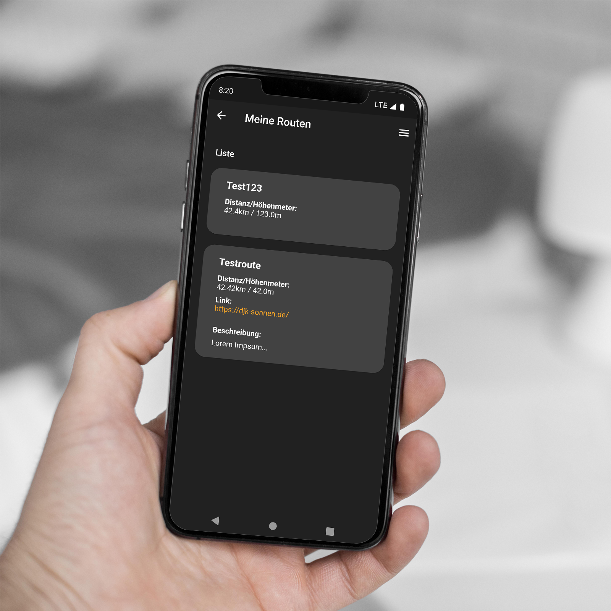

# SunRun Mobile App

for accessing the SunRun web api from mobile devices.
Taylored for Android. IOS not implemented, yet.

 

## Live Version

TODO: playstore entry

## Screenshots

|  Dashboard  |  Menu  |
| :---------: | :---------: |
|  |  |

|  Login  |  Login Android App List  |
| :---------: | :---------: |
|  |  |

|  Create Routes |  | Route Created  | Route List |
| :---------: | :---------: | :---------: | :---------: |
|  |  |  | 

|  Create Activity  |  |  |
| :---------: | :---------: | :---------: |
|  |  |  |

|   |   | Activity Created | Group List  | 
| :---------: | :---------: | :---------: | :---------: | 
|  |  |  | 
